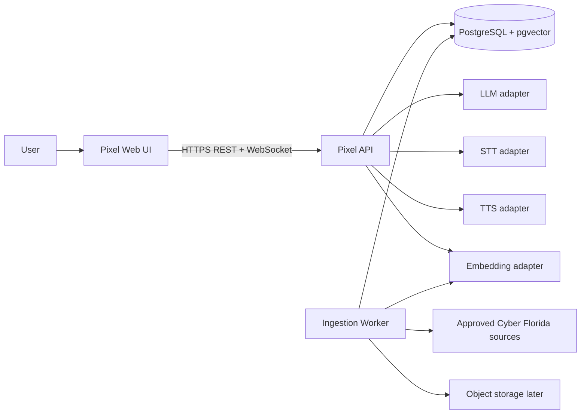
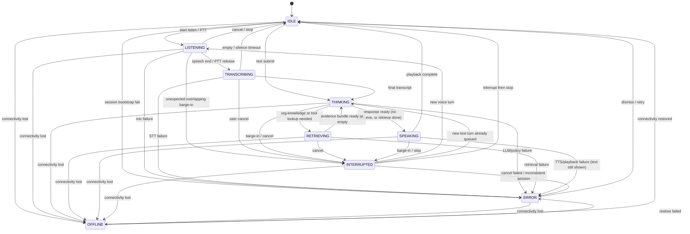

# Pixel — Architecture

**Canonical path:** `docs/architecture.md` (same file as `ARCHITECTURE.md` on Windows).  
**Document status:** Target architecture for a system that is **not yet implemented**.  
**Implemented architecture:** none — no `apps/`, APIs, database, or providers exist. Verified 2026-08-14 (`docs/GAP_ANALYSIS.md`).

This file describes the **intended** platform. Do not read any diagram below as a running system.

**Phase 0 spec alignment:** Entity names, UI states, feedback timing, and provider aliases that differ from the PDF are listed in `docs/risk-register.md` §1 (C-01–C-07). They are **not** silently overwritten here. User-visible states must include IDLE / LISTENING / PROCESSING / SPEAKING / ERROR (`product.md` §20).

Related: `product.md`, `policies.md`, `risk-register.md`, `REQUIREMENTS.md`, `DATA_FLOW.md`, `docs/security/`, `docs/decisions/`, `ROADMAP.md`, `REPOSITORY_ASSESSMENT.md`.

---

## 1. Architecture principles

1. Separate conversation UX from AI provider implementation.
2. Keep privileged tools and secrets server-side.
3. Use retrieval for Cyber Florida facts; never model memory for org-specific claims.
4. Treat retrieved content as **untrusted data**. It cannot override system instructions or grant tools.
5. Treat voice as a real-time transport problem with an explicit state machine.
6. Make every turn observable via a correlation ID and stage timings.
7. Design fail-safe behavior before advanced features.
8. Prefer a modular monolith first. Split processes only when a measured need exists.
9. Never create duplicate STT, TTS, LLM, RAG, or orchestrator systems.
10. Do not fake working functionality with hardcoded answers presented as live AI.

---

## 2. Conceptual request path

```
User
  ↓
Pixel UI
  ↓
Voice / Text Input
  ↓
Backend API
  ↓
Conversation Manager
  ↓
AI Orchestrator
  ↓
Safety / Policy Layer
  ↓
RAG + Tool Router
  ↓
LLM
  ↓
Response Validation
  ↓
TTS
  ↓
Pixel Voice
```

Text-only turns skip STT and may skip TTS (still render transcript + optional speak). Retrieval and tools run only when the orchestrator and policy layer allow them.

---

## 3. System context



External provider SDKs exist **only** inside adapters. Core modules depend on the interfaces in §5.

---

## 4. Responsibility map

| Concern | Owner | Must not do |
|---|---|---|
| **Frontend** | `apps/web` | Hold provider API keys; execute tools; talk to LLM/RAG directly; trust model HTML. |
| **Backend** | `apps/api` | Embed vendor SDKs in domain logic; persist raw audio by default. |
| **AI** | `packages/ai` + orchestrator | Bypass safety layer; treat RAG text as instructions. |
| **Voice** | `packages/voice` + client capture/playback | Put long-lived STT/TTS keys in the browser. |
| **RAG** | `packages/knowledge` + worker | Index non-allowlisted sources; mix public and internal corpora. |
| **Database** | PostgreSQL + pgvector | Store secrets, raw audio, or unbounded PII. |
| **Tools** | `packages/tools` | Accept arbitrary URLs; run client-side privileged actions. |
| **Security** | `packages/security` + API middleware | Rely on UI hiding for authorization. |
| **Observability** | `packages/observability` | Log raw audio, secrets, or full transcripts by default. |

### 4.1 Logical layers

| Layer | Responsibilities |
|---|---|
| Client | Mic permission, capture/playback, transcript, state animation, text fallback, source cards, actions, a11y. |
| API gateway | REST + WebSocket, session bootstrap, rate limits, auth context, health. |
| Speech | VAD (client or server), STT adapter, TTS adapter, playback/cancel. |
| Conversation manager | Session lifecycle, bounded message history, turn IDs, cancellation. |
| AI orchestrator | Intent routing, retrieval/tool decisions, LLM calls, answer assembly. |
| Safety / policy | System policy load, injection defenses, tool permission checks, output filters. |
| RAG + tool router | Retrieval, rerank (later), citations; allowlisted tool dispatch. |
| Knowledge / worker | Fetch, clean, chunk, embed, index, refresh, delete. |
| Data | Conversations, messages, documents, chunks, ingestion jobs, tool executions. |
| Observability | Correlation IDs, stage metrics, structured logs, traces. |

### 4.2 Process topology (MVP)

A **modular monolith**, not a mesh of microservices:

| Process | Role |
|---|---|
| `apps/web` | Next.js UI. |
| `apps/api` | FastAPI: HTTP, WebSocket, orchestrator, RAG query, tools. |
| `apps/worker` | Same codebase, separate process: ingestion/embed jobs. |
| PostgreSQL | System of record + vectors. |

Do **not** split `api-gateway`, `realtime-service`, `orchestrator`, `knowledge-service`, and `tool-service` into separate deployables until latency, scaling, or team boundaries require it. Module boundaries inside `apps/api` still follow those names.

---

## 5. Provider abstraction

Pixel must not be locked to one vendor. Core code depends on these interfaces. First adapters are chosen in §6; swapping an adapter must not rewrite orchestration.

Interfaces below are **contracts**. Implementation languages: Python (backend) with TypeScript mirrors for client-safe view models only.

### 5.1 `LLMProvider`

```python
class LLMProvider(Protocol):
    provider_id: str
    def generate(
        self,
        request: LLMRequest,          # messages, tools schema, params
        *,
        cancellation: CancellationToken,
    ) -> Iterator[LLMEvent]:          # tokens, tool_calls, usage, error
        ...
```

- Input: versioned system policy, bounded conversation, optional retrieved **evidence bundle** (data, not instructions), optional tool schemas.
- Output: streamed tokens and/or structured tool calls.
- Must honor cancellation (barge-in).
- Must not receive raw provider credentials from callers; adapters read env.

### 5.2 `SpeechToTextProvider`

```python
class SpeechToTextProvider(Protocol):
    provider_id: str
    def transcribe(
        self,
        audio: AudioStream | AudioBuffer,
        *,
        language: str | None,
        cancellation: CancellationToken,
    ) -> Iterator[TranscriptEvent]:   # partial, final, error
        ...
```

- Input: PCM/Opus (format negotiated at session start).
- Output: partial and final transcripts.
- Domain hints (cybersecurity terms) may be passed as configuration, not hardcoded vendor features in the orchestrator.

### 5.3 `TextToSpeechProvider`

```python
class TextToSpeechProvider(Protocol):
    provider_id: str
    def synthesize(
        self,
        text: str,
        *,
        voice_id: str,
        cancellation: CancellationToken,
    ) -> Iterator[AudioChunk]:
        ...
```

- Input: already-validated assistant text (post safety).
- Output: streamed or complete audio.
- Must support cancel mid-stream for barge-in.

### 5.4 `EmbeddingProvider`

```python
class EmbeddingProvider(Protocol):
    provider_id: str
    model_id: str
    dimensions: int
    def embed_documents(self, texts: Sequence[str]) -> Sequence[Embedding]:
        ...
    def embed_query(self, text: str) -> Embedding:
        ...
```

- Document and query embeddings must use a compatible model/dimension pair.
- Changing embedding model requires re-index (ingestion job), not silent mix.

### 5.5 `VectorStoreProvider`

```python
class VectorStoreProvider(Protocol):
    def upsert_chunks(self, chunks: Sequence[IndexedChunk]) -> None:
        ...
    def delete_by_document(self, document_id: UUID) -> None:
        ...
    def search(
        self,
        query_embedding: Embedding,
        *,
        top_k: int,
        filters: MetadataFilters,     # access_class, content_type, active, ...
    ) -> Sequence[ScoredChunk]:
        ...
```

- First implementation: PostgreSQL + pgvector (same database as relational data).
- A future dedicated engine (e.g. Qdrant) would implement this interface only.

### 5.6 Client voice transport (not a vendor SDK)

The browser talks only to Pixel:

```ts
interface VoiceSession {
  connect(): Promise<void>;
  startTurn(): Promise<void>;
  sendAudio(chunk: ArrayBuffer): void;
  endTurn(): Promise<void>;
  cancel(): Promise<void>;          // barge-in
  onTranscript: (e: TranscriptEvent) => void;
  onAudio: (e: AudioChunk) => void;
  onState: (s: PixelState) => void;
  onError: (e: PixelError) => void;
  onSources: (s: SourceRef[]) => void;
}
```

The client never instantiates `LLMProvider` / `EmbeddingProvider` / `VectorStoreProvider`.

---

## 6. Technology stack

Evaluated against an **empty repository** (`REPOSITORY_ASSESSMENT.md`). No existing framework to preserve. Avoid unnecessary infrastructure.

### 6.1 Frontend — Next.js (App Router) + React + TypeScript

| Field | Value |
|---|---|
| **Technology** | Next.js 15, React 19, TypeScript |
| **Purpose** | Responsive Pixel UI, state machine, mic/playback, transcripts, source cards |
| **Why selected** | Production web default in the project guide; TypeScript; App Router for routing and future public pages; strong a11y ecosystem |
| **Alternatives** | Vite + React SPA; Remix; SvelteKit |
| **Advantages** | Standard hiring/tooling, SSR/static for marketing/help pages later, first-class TS |
| **Disadvantages** | Heavier than a pure SPA; must keep provider keys out of client bundles |
| **Migration difficulty** | Medium if leaving React; low if staying on React (Vite) |

Styling: Tailwind CSS for speed and consistent spacing; Cyber Florida visual identity applied in Phase 9, not as a blocker for the state machine.

### 6.2 Backend — Python FastAPI

| Field | Value |
|---|---|
| **Technology** | Python 3.12, FastAPI, Pydantic v2, uvicorn |
| **Purpose** | API, WebSocket voice control, orchestrator, RAG query, tools |
| **Why selected** | Strong AI/RAG ecosystem, async, typed settings, matches project guide |
| **Alternatives** | Node/TypeScript (Nest/Fastify); Go |
| **Advantages** | Embeddings, evals, workers share language; FastAPI OpenAPI |
| **Disadvantages** | Two-language monorepo (TS + Python) |
| **Migration difficulty** | High once orchestrator/RAG exist; choose now and keep |

Two languages are accepted: UI in TypeScript, AI/knowledge in Python. Shared contracts documented in `packages/shared` (OpenAPI + exported types), not duplicated ad-hoc JSON.

### 6.3 Database — PostgreSQL + pgvector

| Field | Value |
|---|---|
| **Technology** | PostgreSQL 16 + pgvector |
| **Purpose** | Conversations, messages, documents, chunks, embeddings, jobs, tool audit |
| **Why selected** | One operational store for relational + vectors; enough for Cyber Florida corpus scale; simpler than DB + separate vector DB |
| **Alternatives** | Postgres + Qdrant/Pinecone; SQLite (dev only, not production RAG) |
| **Advantages** | Transactions, backups, metadata filters with vectors, USF-friendly ops |
| **Disadvantages** | Extreme vector scale/latency may eventually need a dedicated engine |
| **Migration difficulty** | Medium (via `VectorStoreProvider`) if pgvector later proves insufficient |

### 6.4 Session / cache — PostgreSQL first; Redis later if needed

| Field | Value |
|---|---|
| **Technology** | PostgreSQL for session rows; in-process cancellation tokens |
| **Purpose** | Conversation state |
| **Why selected** | Avoid Redis until horizontal multi-instance + pub/sub cancellation is measured |
| **Alternatives** | Redis, Memorystore |
| **Advantages** | Less infra in MVP |
| **Disadvantages** | Multi-instance barge-in cancel is weaker until a shared bus exists |
| **Migration difficulty** | Low: add Redis as a session/cache adapter |

### 6.5 Voice transport — WebSocket + push-to-talk first

| Field | Value |
|---|---|
| **Technology** | HTTPS REST + WebSocket for audio frames and control events |
| **Purpose** | Stream audio to STT and audio back from TTS; barge-in signals |
| **Why selected** | Simpler than WebRTC; sufficient for PTT and short turns; faster path to a working loop |
| **Alternatives** | WebRTC (livekit/pipecat); MediaRecorder upload per turn (higher latency) |
| **Advantages** | One backend, easier local dev, explicit turn boundaries |
| **Disadvantages** | Higher latency than WebRTC for always-on conversation |
| **Migration difficulty** | Medium: isolate behind `VoiceSession`; add WebRTC in a later phase if latency requires it |

Hands-free VAD listening is an approved mode after PTT works (FR-01, FR-02).

### 6.6 First provider adapters (replaceable)

| Interface | First adapter (config, not hardcoded core) | Fallback / alt |
|---|---|---|
| LLM | OpenAI-compatible API (OpenAI or Azure OpenAI) | Anthropic adapter |
| STT | OpenAI Whisper API or Deepgram | Azure Speech |
| TTS | OpenAI TTS or Azure Speech | ElevenLabs |
| Embedding | OpenAI `text-embedding-3-small` or compatible | FastEmbed / local model for air-gapped eval |
| Vector store | pgvector | Qdrant adapter later |

Local/dev **mock providers** are mandatory (NFR-09). Default local mode uses mocks so clone-and-run does not require paid keys.

### 6.7 Object storage

| Field | Value |
|---|---|
| **Technology** | Local filesystem in dev; S3-compatible later |
| **Purpose** | Optional raw approved documents (PDF) for re-parse |
| **Why selected** | Not required to start: extracted text can live in Postgres until volume grows |
| **Alternatives** | Always-S3; store binaries in Postgres |
| **Advantages** | Avoids cloud bucket work in Phase 2 |
| **Disadvantages** | Large binaries in Postgres are a later smell |
| **Migration difficulty** | Low |

### 6.8 Auth

| Field | Value |
|---|---|
| **Technology** | Unauthenticated public conversation in MVP; session IDs are random unguessable tokens |
| **Purpose** | Public Q&A without login |
| **Why selected** | Matches public Cyber Florida information use case |
| **Alternatives** | Force login immediately |
| **Advantages** | Low friction |
| **Disadvantages** | Abuse requires rate limits (SEC-04) |
| **Admin** | OIDC (e.g. USF/Azure AD) when admin ingestion ships — architecture-ready, not built in Phase 0 |
| **Migration difficulty** | Medium for SSO; design session table with nullable `subject` now |

### 6.9 Testing, quality, deploy

| Technology | Purpose | Why selected | Alternatives | Advantages | Disadvantages | Migration difficulty |
|---|---|---|---|---|---|---|
| pytest + ruff + pyright | API tests, lint, types | Python standard | mypy, flake8 | Fast, one linter | — | Low |
| Vitest + Playwright + ESLint | Unit + E2E | TS standard | Jest, Cypress | Vite-native, a11y E2E | Playwright heavier | Low |
| Docker Compose | Local API + Postgres | Reproducible | bare metal install | Matches later deploy | Windows volume quirks | Low |
| GitHub Actions (or USF CI) | Lint, typecheck, test, build, SCA | Common | GitLab CI, Azure DevOps | Simple | Org may mandate other CI | Low |
| OpenTelemetry | Traces/metrics | Vendor-neutral | vendor agents only | Portable | Setup cost | Low |

### 6.10 Explicitly deferred infrastructure

Not in MVP unless measured need:

- Kubernetes
- Dedicated vector database
- Kafka / event bus
- Separate API gateway product (Kong, etc.)
- GPU inference cluster
- Mobile-native clients
- WebRTC SFU

---

## 7. Proposed repository structure

```
pixel/
  apps/
    web/                 # Next.js client
    api/                 # FastAPI
    worker/              # ingestion jobs (shares api packages)
  packages/
    ai/                  # LLM adapters, prompts/policies
    voice/               # STT/TTS interfaces + adapters
    knowledge/           # chunking, retrieval, citations
    tools/               # schemas + implementations
    security/            # authz, redaction, injection policy
    observability/       # logging/tracing helpers
    shared/              # types, config schemas
  evals/
    knowledge/
    safety/
    voice/
  infra/                 # compose, later IaC
  docs/
  scripts/
```

Phase 2 creates this tree. Phase 0 does not.

---

## 8. Core API / event contracts

| Endpoint / event | Purpose |
|---|---|
| `POST /v1/sessions` | Create conversation; return session id + permitted capabilities |
| `POST /v1/messages` | Text turn; stream assistant text + sources |
| `WS /v1/realtime` | Audio/control: startTurn, audio, endTurn, cancel, transcript, audio out, state |
| `POST /v1/feedback` | Rating / flag for a message |
| `GET /health` | Liveness; no secrets |
| `GET /ready` | Readiness (DB) |
| `POST /admin/sources` | Authz required — register source |
| `POST /admin/reindex` | Authz required — ingestion job |
| `GET /admin/ingestion/{job_id}` | Authz required — job status |

Admin routes **must not** be implemented as open endpoints. If they exist before SSO, they stay disabled behind config and fail closed.

---

## 9. Conversation state machine

Canonical UI/runtime states:

`IDLE` · `LISTENING` · `TRANSCRIBING` · `THINKING` · `RETRIEVING` · `SPEAKING` · `INTERRUPTED` · `ERROR` · `OFFLINE`

### 9.1 State meanings

| State | Meaning |
|---|---|
| IDLE | Connected enough to start. Mic not capturing. Nothing playing. |
| LISTENING | Mic open; capturing audio (PTT held or hands-free). |
| TRANSCRIBING | Capture ended; STT producing final transcript. |
| THINKING | Orchestrator + LLM running; retrieval not in progress or already merged. |
| RETRIEVING | Knowledge search in progress. (May be nested under thinking in telemetry; UI may show a single “processing” label, but the machine distinguishes them.) |
| SPEAKING | Validated response playing via TTS and/or displayed. |
| INTERRUPTED | Barge-in: playback and generation cancelled; preparing next listen/turn. |
| ERROR | Recoverable failure with a user-visible message and path back to IDLE. |
| OFFLINE | No usable network/backend. Voice and live AI unavailable; cached chrome only. |

### 9.2 Valid transitions



### 9.3 Transition rules

- **No skip:** `LISTENING` does not jump to `SPEAKING`.
- **Barge-in:** from `SPEAKING`, `THINKING`, `RETRIEVING`, or `TRANSCRIBING` → `INTERRUPTED`, then cancel STT/LLM/TTS work for that turn.
- **Text submit:** `IDLE` → `THINKING` (skip listen/transcribe). Optional TTS still uses `SPEAKING`.
- **Empty transcript:** `TRANSCRIBING` → `IDLE` with a non-alarming prompt, not `ERROR`.
- **TTS fail after good text:** `SPEAKING` → `ERROR` or `IDLE` with text visible (FR-19). Prefer showing text and offering retry speak.
- **OFFLINE** may be entered from most states; UI must not continue to send audio.

Invalid examples: `IDLE` → `SPEAKING`; `RETRIEVING` → `LISTENING`; `ERROR` → `SPEAKING`.

---

## 10. RAG design

### 10.1 Trust rule

**Retrieved content is UNTRUSTED DATA.**

- It is evidence for answering, wrapped in a delimiter and labeled as documents.
- It must never be concatenated as system/developer instructions.
- It cannot add tools, change policy, or instruct the model to ignore safety.
- The orchestrator, not the model, decides whether tools run.
- Organization-specific answers require retrieval (or a tiny curated facts table). If evidence is weak, abstain (FR-27).

### 10.2 Chunk metadata (required)

Every indexed chunk carries:

| Field | Purpose |
|---|---|
| `document_id` | Parent document |
| `chunk_id` | Stable chunk identity |
| `title` | Document or page title |
| `source_url` | Canonical URL or file identifier |
| `section` | Heading path / section name |
| `content_type` | e.g. `web_page`, `pdf`, `policy`, `faq`, `program` |
| `published_at` | Source publication date if known |
| `updated_at` | Source last-updated if known |
| `indexed_at` | When this chunk was embedded |
| `content_hash` | Hash of normalized chunk text (change detection) |

Additional operational fields (not shown to the model as instructions): `access_class` (`public` \| `internal`), `ingestion_job_id`, `token_count`, `ordinal`, `is_active`.

### 10.3 Retrieval policy

1. Intent router marks `cyberflorida_knowledge` (and some program/event questions) as **retrieval-required**.
2. Query is built from the current user turn plus minimal resolving context (not the full raw history dump).
3. Embed query → vector search with metadata filters (`is_active`, `access_class` matching the caller).
4. Return top-k chunks with scores and source metadata.
5. Rerank only after a baseline hit-rate is measured (Phase 6).
6. Evidence bundle is passed to the LLM as data. Citations use `source_url` / title.
7. Output validator rejects org-specific claims with no supporting chunk.

Public and internal corpora must not share an index without `access_class` enforcement. MVP indexes **public** Cyber Florida content only.

### 10.4 Allowlist

Only registered sources in the knowledge tables may be fetched. No open-web browse tool in MVP.

---

## 11. Database schema (initial)

Only data genuinely needed for conversation, RAG, ingestion, and tool audit. UUIDs for public IDs. Timestamps UTC.

### 11.1 `conversations`

A conversation is a bounded session (the project guide’s “session”).

| Column | Type | Notes |
|---|---|---|
| `id` | UUID PK | Session token reference |
| `subject` | text NULL | Auth subject when logged in; NULL = anonymous |
| `status` | text | `active`, `cleared`, `expired` |
| `policy_version` | text | Which Pixel policy applied |
| `created_at` | timestamptz | |
| `expires_at` | timestamptz | Hard TTL |
| `last_activity_at` | timestamptz | |

No long-term user profile table in MVP.

### 11.2 `messages`

| Column | Type | Notes |
|---|---|---|
| `id` | UUID PK | Turn/message id; correlation-friendly |
| `conversation_id` | UUID FK | |
| `role` | text | `user`, `assistant`, `system_notice` |
| `input_mode` | text NULL | `voice`, `text` (user turns) |
| `status` | text | `pending`, `complete`, `cancelled`, `error` |
| `content` | text | Transcript or assistant text |
| `source_refs` | jsonb | Citation list for assistant messages |
| `error_code` | text NULL | |
| `started_at` / `completed_at` | timestamptz | Stage timing via child metrics or jsonb `timings` |
| `timings` | jsonb | stt_ms, retrieve_ms, llm_ms, tts_ms |
| `created_at` | timestamptz | |

Do not store raw audio. Do not store chain-of-thought.

### 11.3 `knowledge_documents`

| Column | Type | Notes |
|---|---|---|
| `id` | UUID PK | `document_id` |
| `source_url` | text unique | Canonical URL or `file://` key |
| `title` | text | |
| `content_type` | text | |
| `access_class` | text | `public` default |
| `published_at` | timestamptz NULL | |
| `updated_at` | timestamptz NULL | Source-declared |
| `content_hash` | text | Full-document normalized hash |
| `status` | text | `active`, `inactive`, `failed` |
| `last_fetched_at` | timestamptz NULL | |
| `created_at` | timestamptz | |

### 11.4 `knowledge_chunks`

| Column | Type | Notes |
|---|---|---|
| `id` | UUID PK | `chunk_id` |
| `document_id` | UUID FK | |
| `ordinal` | int | Order in document |
| `section` | text | Heading path |
| `content` | text | Chunk body |
| `content_hash` | text | |
| `token_count` | int | |
| `embedding` | vector(n) | Dimension fixed per embedding model |
| `indexed_at` | timestamptz | |
| `is_active` | bool | |
| `metadata` | jsonb | Extra filters; title/source_url denormalized for search hits |

Title and `source_url` are available via join to `knowledge_documents` and may be denormalized into `metadata` for retrieval speed.

### 11.5 `ingestion_jobs`

| Column | Type | Notes |
|---|---|---|
| `id` | UUID PK | |
| `source_url` | text NULL | Null = full reindex |
| `job_type` | text | `fetch`, `reindex`, `delete` |
| `status` | text | `queued`, `running`, `succeeded`, `failed` |
| `actor` | text | Admin subject or `system` |
| `error` | text NULL | Sanitized |
| `stats` | jsonb | pages, chunks, skipped |
| `created_at` / `started_at` / `finished_at` | timestamptz | |

### 11.6 `tool_executions`

| Column | Type | Notes |
|---|---|---|
| `id` | UUID PK | |
| `conversation_id` | UUID FK | |
| `message_id` | UUID FK NULL | |
| `tool_name` | text | Allowlisted name |
| `arguments` | jsonb | Validated, redacted |
| `permission` | text | `allowed`, `denied`, `needs_confirmation` |
| `result_status` | text | `ok`, `error`, `cancelled` |
| `result_summary` | text | No privileged raw payloads to the model |
| `created_at` | timestamptz | |

### 11.7 Intentionally omitted from v1 schema

| Omitted | Why |
|---|---|
| `users` / profiles | No personalization in MVP; `conversations.subject` is enough |
| Raw audio blobs | PRIV-01 |
| Full HTML snapshots in the hot path | Optional object storage later |
| `feedback` | MVP (FR-20) but not needed until the endpoint exists — add a narrow table in Phase 10 (`id`, `message_id`, `rating`/`category`, optional comment, `created_at`). Do not invent it empty in Phase 2 migrations. |
| Generic `audit_events` | `tool_executions` + `ingestion_jobs.actor` cover MVP audit; generalize later |

FR-20 remains in scope for production. The six tables above are the **initial** schema; `feedback` is an intentional Phase 10 addition, not a dropped requirement.

---

## 12. Safety placement

Every user turn:

1. Conversation manager appends the user message (size-limited).
2. Safety layer classifies jailbreak/exfil/harmful-cyber patterns on **user** text.
3. Orchestrator chooses retrieve / tools / direct answer.
4. RAG returns evidence; safety wraps it as untrusted.
5. Tool router runs only allowlisted, authorized, schema-valid calls.
6. LLM generates.
7. Response validation: no secret leakage, no unauthorized tool echo, org claims cited or abstain, defensive-only cyber guidance.
8. Then TTS + UI.

---

## 13. Observability (architectural)

- `conversation_id` + `message_id` = correlation.
- Metrics: STT, retrieve, LLM, TTS, total, barge-in cancel time, error codes.
- Logs: event name, ids, durations, provider_id, **not** default transcript body.
- Version stamps on each turn: app, policy, model config, index generation.

---

## 14. Architecture decision records (initial)

| ADR | Decision |
|---|---|
| ADR-001 | Modular monolith: Next.js + FastAPI + Postgres/pgvector |
| ADR-002 | Provider interfaces for LLM, STT, TTS, embeddings, vector store |
| ADR-003 | WebSocket + PTT before WebRTC |
| ADR-004 | Retrieved content is untrusted; retrieval required for org facts |
| ADR-005 | No Redis until measured |
| ADR-006 | Public anonymous sessions; admin SSO later, fail closed |
| ADR-007 | Mock providers default in local development |

Formal ADR files can be added in Phase 2; these decisions are binding for Phase 0.

---

## 15. What this architecture is not

- Not a running assistant.
- Not a commitment to a specific paid vendor account.
- Not USF security-architecture sign-off.
- Not permission to skip tests, evals, or hardening phases.
